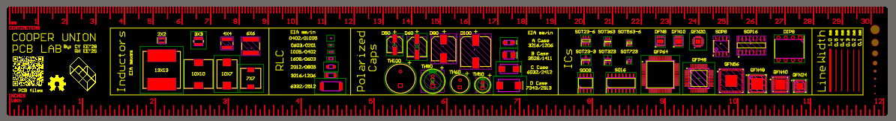
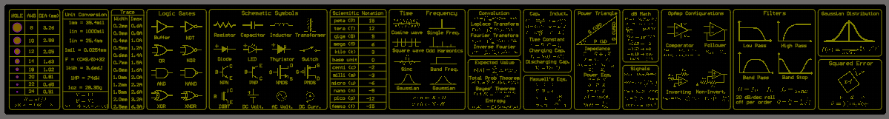
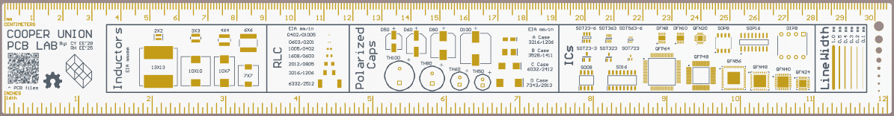
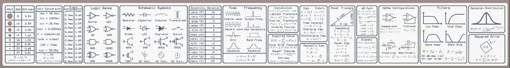

# PCB Ruler
The Cooper Union PCB Ruler was heavily inspired by the NVIDIA PCB ruler with the goal of creating an aesthetic ruler that had all the formulas, conversions, and diagrams an electrical engineer would need in their Cooper career.

The front of the ruler features the footprints of commonly used surface mount components. The back of the ruler contains formulas, conversions, and symbols.

## Altium files

These files include the schematic, layout, and Gerber files for the PCB ruler. The schematic document was used solely to organize and import the footprints used on the front side of the ruler. 

Below is the layout of the front side of the ruler: 

Below is the layout of the back side of the ruler: 

Below is the model of the front side of the ruler: 

Below is the model of the back side of the ruler: 
