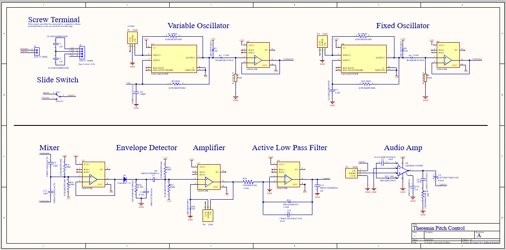
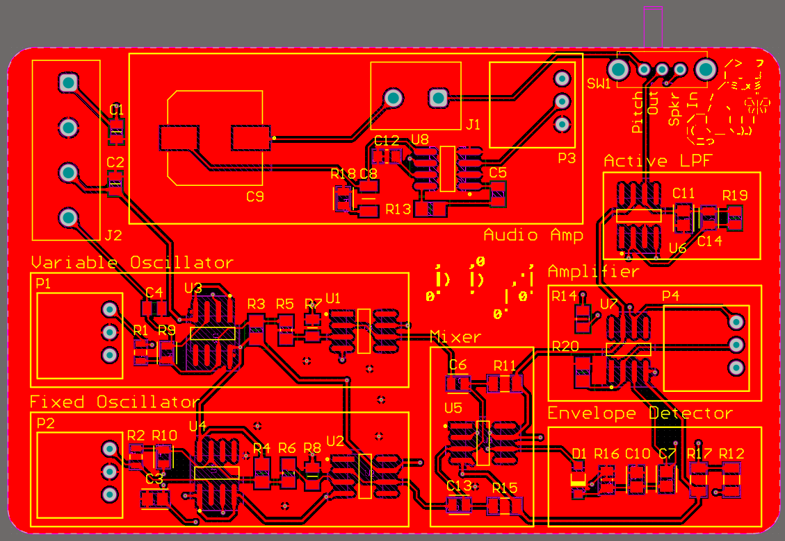
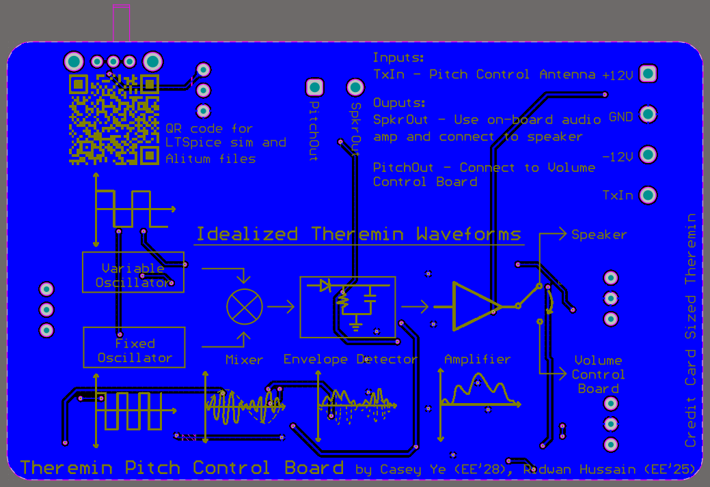
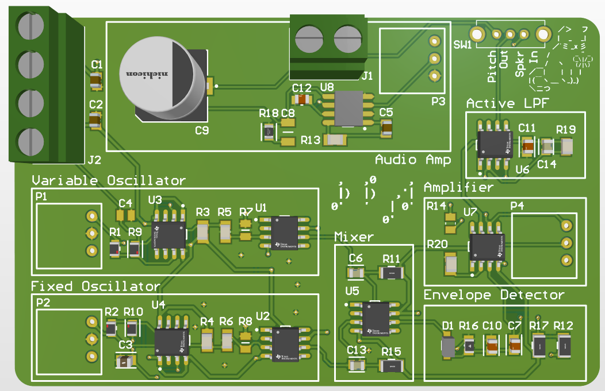
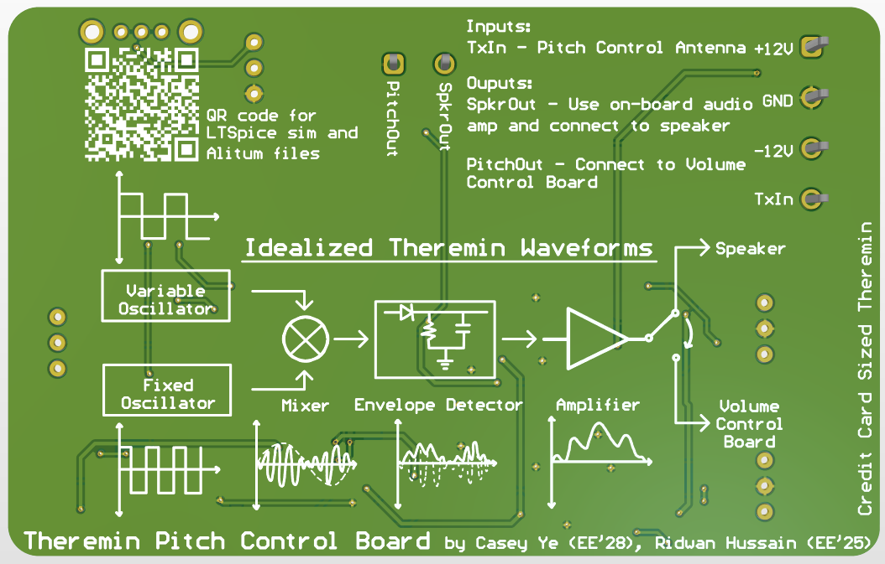

# Theremin Pitch Control

This directory contains both the LTSpice simulation and the Altium files for the Theremin Pitch Control board. 

The theremin pitch control is the circuit that controls the pitch of the theremin through variable and fixed oscillataors. An antenna is to be connected to this board and the closer your hand is to the antenna rod, the higher the pitch the theremin will make.

One consideration when making this board was including an on-board audio amp. This board can be used on it's own to only have pitch control over the theremin and can be connected directly to a speaker. However, by utilizing the switch on the board, the board can also be connected to the volume control board, with its own audio amp. 

Another main consideration was signal integrity. Double GND planes were used to isolate the signal traces, reducing noise between them. Similarly, the distance between these traces were also maximized to reduce interferences between traces. Stitching vias were also used to connect the GND planes to parts of the board that would otherwise have dead copper. Digital and power traces were made thicker to allow for a better current capacity. 

The board was also intentionally designed to be the size of a credit card, so you can carry around your own theremin in your wallet!

## LTSpice Simulations

These files include the simulation used to test the circuit as well as the files for the components used in the simulation.

## Altium files

These files include the schematic, layout, and Gerber files of the Pitch Control board. 'theremin2.PCBDoc' is the file of the final layout. Any other '.PCBDoc was' an old version of the layout.

Below is an image of the schematic: 

Below is an image of the layout of the top layer:

Below is an image of the layout of the bottom layer:

Below is an image of the 3D model of the top layer:

Below is an image of the 3D model of the bottom layer:
